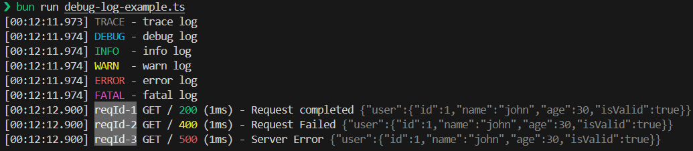

# Hono + Pino

[![npm version][npm-version-src]][npm-version-href]
[![npm downloads][npm-downloads-src]][npm-downloads-href]
[![JSR][jsr-version-src]][jsr-version-href]
[![JSR][jsr-score-src]][jsr-score-href]
[![bundle][bundle-src]][bundle-href]
[![Codecov][codecov-src]][codecov-href]
[![License][license-src]][license-href]

A [pino](https://github.com/pinojs/pino) logger plugin for [hono](https://github.com/honojs/hono).

---

## Features

- Fast, minimal overhead logging for Hono
- Full [pino](https://github.com/pinojs/pino) compatibility
- Works in Node.js and browser
- Custom transports, including a built-in pretty/debug transport
- TypeScript support

---

## Table of Contents

- [Installation](#installation)
- [Usage](#usage)
- [Example](#example)
- [Options & Types](#options--types)
- [Contributing](#contributing)
- [License](#license)

This repository is inspired by [pino-http](https://github.com/pinojs/pino-http) and [nestjs-pino](https://github.com/iamolegga/nestjs-pino).

## Runtime Support

> [!IMPORTANT]
> This package uses pino. Pino is designed for Node.js and supports browser environments.  
> For edge environments (e.g. Cloudflare Workers), some advanced pino features may not work.  
> If fixing these issues is feasible, I will make an effort to implement it, but I cannot guarantee this.

Known issues:

- `transports`: Alternative -> browser.write

## Installation

```bash
# npm
npm install hono-pino pino
# pnpm
pnpm add hono-pino pino
# bun
bun add hono-pino pino
```

## Usage

```ts
import { Hono } from 'hono'
import { pinoLogger } from 'hono-pino'

const app = new Hono()
  .use(
    pinoLogger({
      pino: {level: "debug"}
    }),
  )
  .get((c) => {
    const { logger } = c.var;

    const token = c.req.header("Authorization") ?? "";
    logger.debug({ token });

    const user = getAuthorizedUser(token);
    logger.assign({ user });

    const posts = getPosts();
    logger.assign({ posts });


    logger.setResMessage("Get posts success"); // optional

    return c.text("");
  });

await app.request("/", {
  headers: {
    Authorization: "Bearer token",
  },
});

// output (formatted for easier reading)
{"level":20, "token":"Bearer token"}
{
  "level": 30,
  "msg": "Get posts success",
  "user": {
    "id": 1,
    "name": "john"
  },
  "posts": [
    {
      "id": 1,
      "title": "My first post"
    },
    {
      "id": 2,
      "title": "My second post"
    }
  ],
  "req": {
    "headers": {
      "authorization": "Bearer token"
    },
    "method": "GET",
    "url": "/"
  },
  "reqId": 1,
  "res": {
    "headers": {},
    "status": 200
  },
  "responseTime": 2
}
```

## Example

See [examples](./examples/)

## hono-pino/debug-log Transport

`hono-pino/debug-log` is a lightweight [pino](https://github.com/pinojs/pino) transport designed for development and debugging. It makes logs more readable, similar to `pino-pretty`, but with a focus on simplicity and customization.



### Options

- `colorEnabled`: Enable or disable color output (`true` | `false` | `undefined` for auto)
- `messageKey`: The key for the log message (default: `msg`)
- `requestKey`: The key for the request object (default: `req`)
- `responseKey`: The key for the response object (default: `res`)
- `levelLabelMap`: Map of log level numbers to their string labels
- `normalLogFormat`: Format string for normal logs (default: `[{time}] {levelLabel} - {msg}`)
- `httpLogFormat`: Format string for HTTP logs (default: `[{time}] {reqId} {req.method} {req.url} {res.status} ({responseTime}ms) - {msg} {bindings}`)
- `timeFormatter`: Function to format the time value (default: `defaultTimeFormatter`)
- `bindingsFormatter`: Function to format the context (bindings) (default: `defaultBindingsFormat`)
- `levelFormatter`: Function to format the log level label (default: `defaultLevelFormatter`)
- `printer`: Function to print the final log output (default: `console.log`)

See all options in [src/debug-log/types.d.ts](./src/debug-log/types.d.ts)

### Basic Usage (Node.js)

```ts
import pino from "pino";
import { Hono } from "hono";
import { pinoLogger } from "hono-pino";
import type { DebugLogOptions } from "hono-pino/debug-log";

const options: DebugLogOptions = {
  // options...
};

const app = new Hono().use(
  pinoLogger({
    pino: pino({
      base: null,
      level: "trace",
      transport: {
        target: "hono-pino/debug-log",
        options,
      },
      timestamp: pino.stdTimeFunctions.unixTime, // hh:mm:ss
      // or
      // timestamp: pino.stdTimeFunctions.epochTime, // hh:mm:ss.sss
    }),
  })
);
```

### Basic Usage (Browser)

```ts
import pino from "pino";
import { Hono } from "hono";
import { pinoLogger } from "hono-pino";
import { createHandler as debugLog } from "hono-pino/debug-log";

const app = new Hono().use(
  pinoLogger({
    pino: pino({
      level: "trace",
      browser: {
        write: debugLog({
          ...options
        }),
      },
    }),
  })
);
```

---

## Options & Types

View the full options on
[GitHub](./src/types.ts) or [JSR](https://jsr.io/@maou-shonen/hono-pino/doc)

### Logger Methods

```ts
class PinoLogger {
  // Same as pino[logger level]
  trace: pino.LogFn
  debug: pino.LogFn
  info: pino.LogFn
  warn: pino.LogFn
  error: pino.LogFn
  fatal: pino.LogFn

  // Get bindings (object)
  bindings(): pino.Bindings
  // Reset bindings
  resetBindings(): void
  // Assign bindings (default shallow merge)
  assign(
    bindings: pino.Bindings
    opts?: {
      /** deep merge */
      deep?: boolean;
    },
  ): void
}
```

---

## Contributing

Contributions, issues and feature requests are welcome! Feel free to check [issues page](https://github.com/maou-shonen/hono-pino/issues) or submit a pull request.

## License

This project is [MIT](./LICENSE) licensed.

---

## API Documentation

See the full API docs at [jsr.io/@maou-shonen/hono-pino](https://jsr.io/@maou-shonen/hono-pino/doc)

<!-- Refs -->

[npm-version-src]: https://img.shields.io/npm/v/hono-pino
[npm-version-href]: https://npmjs.com/package/hono-pino
[npm-downloads-src]: https://img.shields.io/npm/dm/hono-pino
[npm-downloads-href]: https://npmjs.com/package/hono-pino
[jsr-version-src]: https://jsr.io/badges/@maou-shonen/hono-pino
[jsr-version-href]: https://jsr.io/@maou-shonen/hono-pino
[codecov-src]: https://img.shields.io/codecov/c/gh/maou-shonen/hono-pino/main
[jsr-score-src]: https://jsr.io/badges/@maou-shonen/hono-pino/score
[jsr-score-href]: https://jsr.io/@maou-shonen/hono-pino/score
[codecov-href]: https://codecov.io/gh/maou-shonen/hono-pino
[bundle-src]: https://img.shields.io/bundlephobia/minzip/hono-pino
[bundle-href]: https://bundlephobia.com/result?p=hono-pino
[license-src]: https://img.shields.io/github/license/maou-shonen/hono-pino.svg
[license-href]: https://github.com/maou-shonen/hono-pino/blob/main/LICENSE
